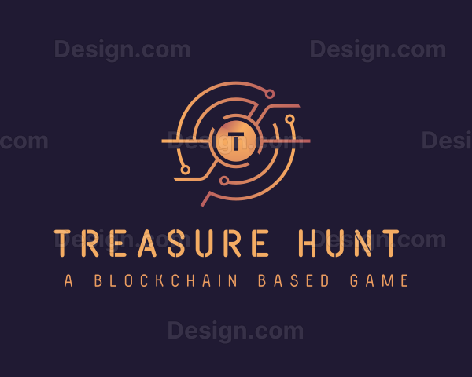

# 🎮 Blockchain Treasure Hunt Game

<div align="center">
  
  <h3>Find the hidden treasure on the Ethereum blockchain and win ETH rewards!</h3>
</div>

<div align="center">

[](https://reactjs.org/)
[](https://ethereum.org/)
[](https://trufflesuite.com/)
[](https://firebase.google.com/)
[](https://tailwindcss.com/)

</div>

## ✨ Features

- 🎲 Interactive 10x10 game board with treasure hunting mechanics
- 🔐 Firebase Authentication with user profiles and statistics
- 📊 Leaderboard system to track top players
- 💰 Real cryptocurrency rewards for finding treasures
- 🔄 Smart contract integration with Ethereum blockchain
- 📱 Responsive design for desktop and mobile
- 🌙 Game-themed UI with modern design elements

## 🛠️ Technologies Used

- **Frontend**: React, Tailwind CSS, React Router, React Icons
- **Blockchain**: Ethereum, Web3.js, Truffle Framework
- **Authentication**: Firebase Authentication & Firestore
- **State Management**: React Context API
- **Notifications**: React Toastify

## 📋 Prerequisites

Before you begin, ensure you have the following installed:

- [Node.js](https://nodejs.org/) (v14+)
- [npm](https://www.npmjs.com/) or [yarn](https://yarnpkg.com/)
- [Truffle](https://trufflesuite.com/truffle/) (`npm install -g truffle`)
- [Ganache](https://trufflesuite.com/ganache/) for local blockchain development
- [MetaMask](https://metamask.io/) browser extension
- [Firebase](https://firebase.google.com/) account

## 🚀 Getting Started

### Installation

1. **Clone the repository**

```bash
git clone https://github.com/yourusername/blockchain-treasure-hunt.git
cd blockchain-treasure-hunt
```
2. **Install dependencies**
   ```bash
         npm install
   ```

4. **Create environment variables**


Create a `.env` file in the root directory with the following variables:

```plaintext
# Blockchain
REACT_APP_INFURA_ID=your_infura_project_id
REACT_APP_PRIVATE_KEY=your_private_key_here

# Firebase
REACT_APP_FIREBASE_API_KEY=your_firebase_api_key
REACT_APP_FIREBASE_AUTH_DOMAIN=your_firebase_auth_domain
REACT_APP_FIREBASE_PROJECT_ID=your_firebase_project_id
REACT_APP_FIREBASE_STORAGE_BUCKET=your_firebase_storage_bucket
REACT_APP_FIREBASE_MESSAGING_SENDER_ID=your_firebase_messaging_sender_id
REACT_APP_FIREBASE_APP_ID=your_firebase_app_id
```

### 📝 Smart Contract Deployment

1. **Start Ganache**


Launch Ganache to create a local blockchain for development.

2. **Configure Truffle**


Ensure your `truffle-config.js` is properly configured to connect to your Ganache instance or desired network.

3. **Compile the smart contract**


```shellscript
truffle compile
```

4. **Deploy to local development network**


```shellscript
truffle migrate --network development
```

5. **Deploy to Sepolia testnet** (optional)


```shellscript
truffle migrate --network sepolia
```

6. **Update contract address**


After deployment, copy the contract address and update it in `public/config.js`:

```javascript
window.TreasureHuntConfig = {
  CONTRACT_ADDRESS: "your_deployed_contract_address",
  // other config options...
};
```

### 🖥️ Running the Frontend

1. **Start the development server**


```shellscript
npm start
```

2. **Access the application**


Open your browser and navigate to `http://localhost:3000`

3. **Connect MetaMask**


- Connect MetaMask to the appropriate network (local Ganache or Sepolia testnet)
- Import accounts using private keys if needed
- Ensure you have test ETH in your wallet


## 🎯 Game Rules

1. **Setup**:
   1. Create an account or login with Firebase
   2. Connect your Ethereum wallet
   3. Join the game by paying the join fee (default: 0.001 ETH)


2. **Gameplay**:

   1. You'll be placed at a random position on the 10x10 grid
   2. Move to adjacent cells (including diagonals) by clicking on them
   3. Each player can make one move per turn
   4. Find the hidden treasure to win the entire pot!


3. **Winning**:

   1. The first player to land on the treasure position wins
   2. The winner receives all ETH in the contract
   3. After each round, a new treasure is hidden at a random position


## 📁 Project Structure

```plaintext
blockchain-treasure-hunt/
├── contracts/                 # Smart contracts
│   └── TreasureHunt.sol       # Main game contract
├── migrations/                # Truffle migration scripts
│   ├── 1_initial_migration.js
│   └── 2_deploy_contracts.js
├── public/                    # Static files
│   ├── config.js              # Game configuration
│   ├── index.html
│   └── logo.svg
├── src/
│   ├── components/            # React components
│   │   ├── GameBoard.jsx
│   │   ├── GameControls.jsx
│   │   ├── GameInfo.jsx
│   │   ├── Header.jsx
│   │   └── WalletConnect.jsx
│   ├── context/               # React context providers
│   │   ├── AuthContext.js
│   │   └── GameContext.js
│   ├── firebase/              # Firebase configuration
│   │   └── firebase.js
│   ├── pages/                 # Page components
│   │   ├── GamePage.jsx
│   │   ├── LeaderboardPage.jsx
│   │   ├── LoginPage.jsx
│   │   ├── ProfilePage.jsx
│   │   └── RegisterPage.jsx
│   ├── App.jsx                # Main application component
│   └── index.js               # Entry point
├── test/                      # Truffle tests
│   └── treasure_hunt.js
├── truffle-config.js          # Truffle configuration
└── package.json               # Project dependencies
```

## ⚙️ Customization

You can customize the game by modifying the following files:

- **`public/config.js`**: Update contract address, join fee, and other settings
- **`contracts/TreasureHunt.sol`**: Modify game rules and mechanics
- **`src/components/`**: Customize UI components
- **`truffle-config.js`**: Configure networks and compiler options


## 🔧 Troubleshooting

### Common Issues

1. **MetaMask Connection Issues**

1. Ensure MetaMask is unlocked and connected to the correct network
2. Reset your account in MetaMask if transactions are pending


2. **Contract Deployment Failures**

1. Check that Ganache is running and accessible
2. Verify your private key and network configurations


3. **Firebase Authentication Problems**

1. Confirm that Firebase is properly configured with authentication enabled
2. Check that all environment variables are correctly set


## 📈 Future Enhancements

- Multiplayer turn-based system with time limits
- NFT rewards for treasure hunters
- Mobile app version with push notifications
- Enhanced game mechanics (items, obstacles, special abilities)
- Integration with more blockchain networks


## 🙏 Acknowledgements

- [Truffle Suite](https://trufflesuite.com/) for blockchain development tools
- [Ethers.js](https://docs.ethers.io/) for Ethereum interaction
- [React](https://reactjs.org/) for the frontend framework
- [Tailwind CSS](https://tailwindcss.com/) for styling
- [Firebase](https://firebase.google.com/) for authentication and database
- [React Icons](https://react-icons.github.io/react-icons/) for UI icons
- [React Toastify](https://fkhadra.github.io/react-toastify/) for notifications

   
